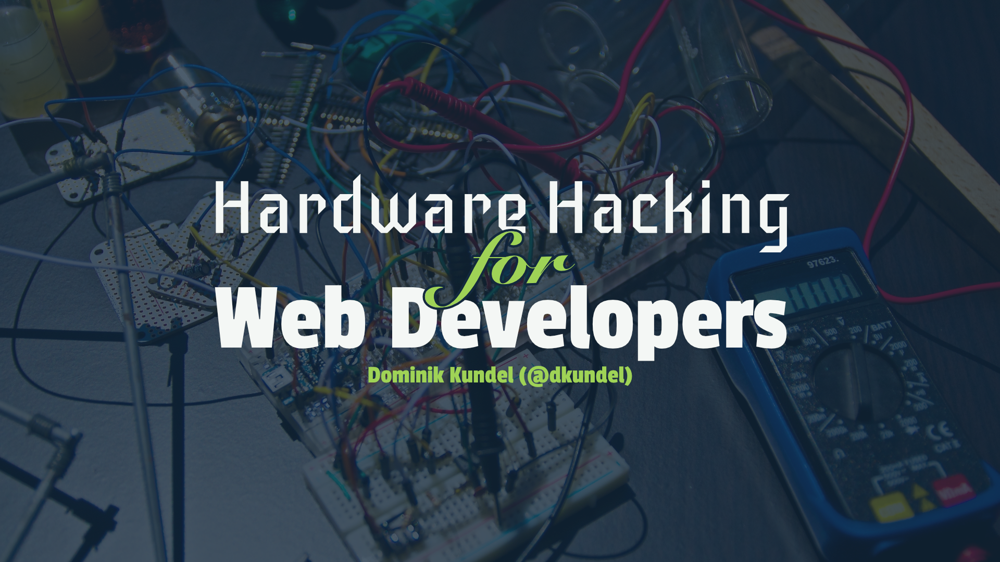
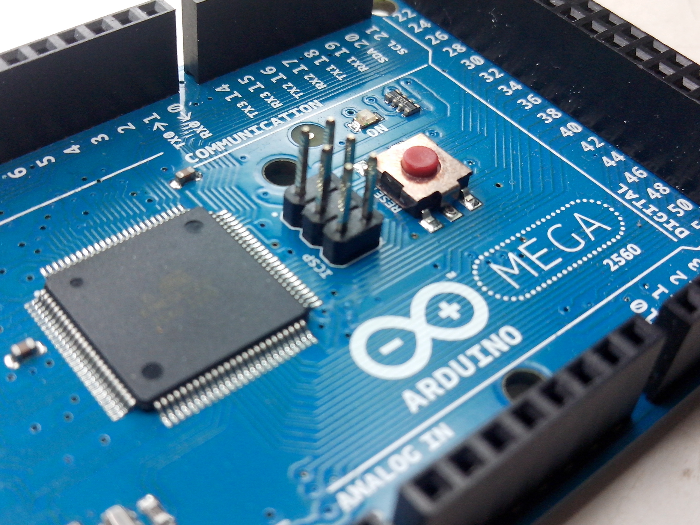
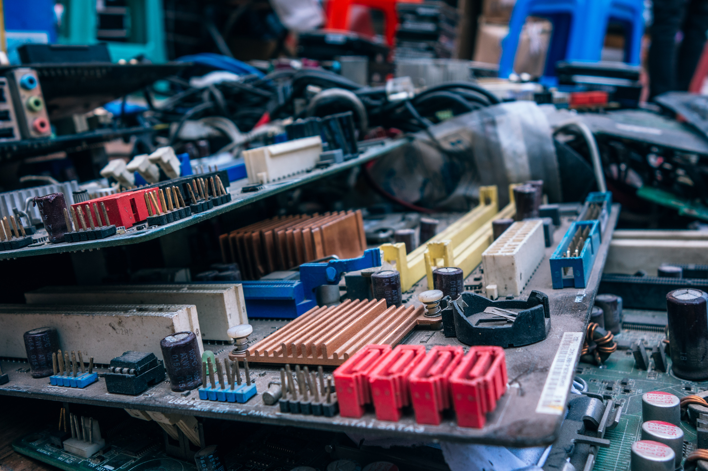
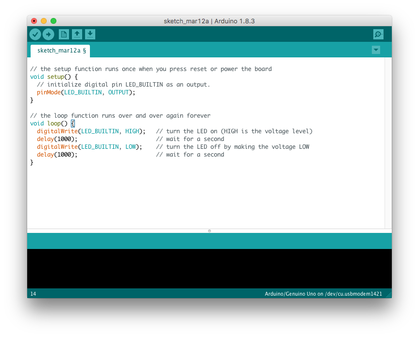
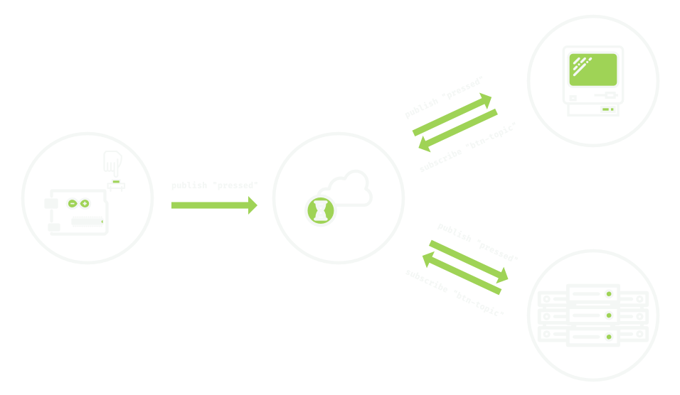
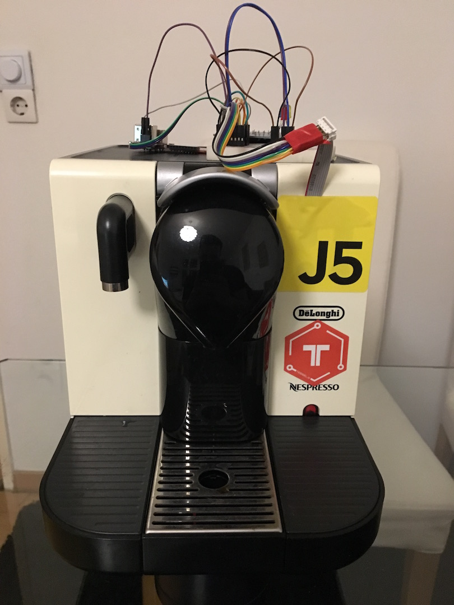
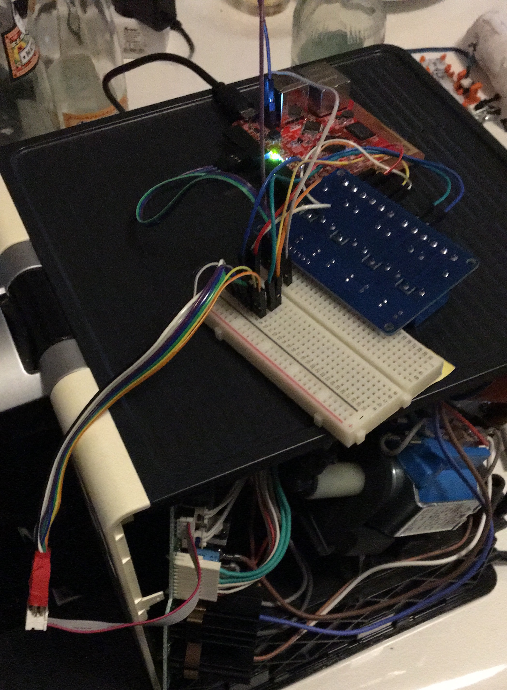

footer: Dominik Kundel | [@dkundel](https://twitter.com/dkundel) | #nodejsberlin #nodebots #porgjs #coffeejs
slidenumbers: false
build-lists: true
autoscale: true
theme: Anker
code: Fira Code, #56c8d3, #569ed3, #d35674, #9ed356, #9ed356



---

[.footer: Dominik Kundel | [@dkundel](https://twitter.com/dkundel) | Photo by Felipe Faria on Unsplash]



## How many of you have a

# Microcontroller?

^ How many of you have a Raspberry PI or an Arduino or any kind of microcontroller?

---

[.footer: Dominik Kundel | [@dkundel](https://twitter.com/dkundel) | Photo by Igor Ovsyannykov on Unsplash]



# Did you use it?

^ How many of you actually used them for a project?

---

[.background-color: #000]

^ I would like to see if I can inspire you over the next 30 minutes to finally start hardware hacking and give you an idea of how you can approach it

---

## _Hi!_ <br> _I'm Dominik Kundel!_


Developer Evangelist at <br><br>


🐦 [@dkundel](https://twitter.com/dkundel)
📧 [dkundel@twilio.com](mailto:dkundel@twilio.com)
💻 [github/dkundel](https://github.com/dkundel)

^ I'm a developer evangelist for a company called Twilio

---

[.footer: Photo by Thomas William & Thomas Kvistholt on Unsplash]


# I 💖 JavaScript

^ I love writing JavaScript for anything from browsers, to servers and command-line tools all the way to…

---

[.footer: Dominik Kundel | [@dkundel](https://twitter.com/dkundel) | Photo by Felipe Faria on Unsplash]


# Hardware

^ ...Hardware

---

[.footer: Dominik Kundel | [@dkundel](https://twitter.com/dkundel) | Photo by Igor Ovsyannykov on Unsplash]


# The destiny of Hardware

^ Similar to a bunch of you I just gathered over time more and more hardware but all of it was just gathering dust

---

[.background-color: #ffffff]

# Simple LED demos


^ would be used to at most to try a simple "LED demo"

---

[.footer: Dominik Kundel | [@dkundel](https://twitter.com/dkundel) | Photo by Nicolas Thomas on Unsplash]


# It's not easy...

^ And I don't know about you but for me Hardware hacking is way more complicated than a simple software hacking session

---

# 🕰 Preparation

^ It requires preparation

---

# 💰 Costly 💰

^ The costs are higher

---

# 🚫 ⌘ + Z / Ctrl+Z

^ There is no git revert or even Cmd+Z in a lot of cases

---

#

# 😊 Rewarding 🎉

^ But if you get a project to work it can be incredibly rewarding

---

# `C/C++`



---

# 🤷‍♀️ `C/C++` 🤷‍♂️

^ I'm not sure how it is for you but I don't remember most of my university time learning C/C++ anymore

---

## Three ways to combine

# JavaScript & Hardware

---

# APIs & Protocols

## [fit] JavaScript ➡ API ➡ C/C++ ➡ Hardware

---

### APIs & Protocols Option 1:

# Particle Cloud API

---

# What is a [Particle](https://particle.io)?


### 🌐 [`particle.io`](https://particle.io)

---

## Particle Cloud API Example

```bash
curl https://api.particle.io/v1/devices/0123456789abcdef/brew \
     -d access_token=123412341234 \
     -d "args=coffee"
```

```cpp
void setup()
{
  // register the cloud function
  Particle.function("brew", brewCoffee);
}
int brewCoffee(String command)
{
  if(command == "coffee")
  {
    return 1;
  }
  else return -1;
}
```

---

### APIs & Protocols Option 2

# MQTT

#### Lightweight machine-to-machine publish/subscribe messaging protocol

---



---

# MQTT

🤷‍♂️ No need for IP Address of a device 🤷‍♀️
⚖️ Scales to multiple devices
✅ Cross-platform / Cross-language

---

# MQTT Example in JS

```js
var mqtt = require('mqtt');
var client = mqtt.connect('mqtt://test.mosquitto.org');

client.on('connect', function() {
  client.subscribe('presence');
  client.publish('presence', 'Hello mqtt');
});

client.on('message', function(topic, message) {
  // message is Buffer
  console.log(message.toString());
  client.end();
});
```

---

# MQTT Example in `C++`

```cpp
#include <SPI.h>
#include <Ethernet.h>
#include <PubSubClient.h>

// Update these with values suitable for your network.
byte mac[]    = {  0xDE, 0xED, 0xBA, 0xFE, 0xFE, 0xED };
IPAddress ip(172, 16, 0, 100);
IPAddress server(172, 16, 0, 2);

void callback(char* topic, byte* payload, unsigned int length) {
  Serial.print("Message arrived [");
  Serial.print(topic);
  Serial.print("] ");
  for (int i=0;i<length;i++) {
    Serial.print((char)payload[i]);
  }
  Serial.println();
}

EthernetClient ethClient;
PubSubClient mqttClient(ethClient);

void reconnect() {
  // Loop until we're reconnected
  while (!mqttClient.connected()) {
    Serial.print("Attempting MQTT connection...");
    // Attempt to connect
    if (mqttClient.connect("arduinoClient")) {
      Serial.println("connected");
      // Once connected, publish an announcement...
      mqttClient.publish("outTopic","hello world");
      // ... and resubscribe
      mqttClient.subscribe("inTopic");
    } else {
      Serial.print("failed, rc=");
      Serial.print(client.state());
      Serial.println(" try again in 5 seconds");
      // Wait 5 seconds before retrying
      delay(5000);
    }
  }
}

void setup()
{
  Serial.begin(57600);

  mqttClient.setServer(server, 1883);
  mqttClient.setCallback(callback);

  Ethernet.begin(mac, ip);
  // Allow the hardware to sort itself out
  delay(1500);
}

void loop()
{
  if (!mqttClient.connected()) {
    reconnect();
  }
  mqttClient.loop();
}
```

---

# MQTT Subscribe

```cpp
boolean rc = mqttClient.subscribe("myTopic");
```

---

# MQTT Setup

```cpp
void setup()
{
  Ethernet.begin(mac, ip);
  // Allow the hardware to sort itself out
  delay(1500);
  mqttClient.setServer(server, 1883);

  if (mqttClient.connect("myClientID")) {
    // connection succeeded
  }
}

void loop()
{
  mqttClient.loop();
}
```

---

# MQTT Callback

```cpp
void callback(char* topic, byte* payload, unsigned int length) {
  // Allocate the correct amount of memory for the payload copy
  byte* p = (byte*)malloc(length);
  // Copy the payload to the new buffer
  memcpy(p,payload,length);
  // Republish the received message
  mqttClient.publish("outTopic", p, length);
  // Free the memory
  free(p);
}
mqttClient.setCallback(callback);
```

---


### Example

# [fit] Twitch Live Lamp

#### [fit] 🌐 [github.com/dkundel/twitch-live-lamp](https://github.com/dkundel/twitch-live-lamp)

---

#### API & Protocols

# 👍 Pros

💡 Lightweight, intuitive ways to communicate between devices
🚚 Move heavy business logic off devices
🌈 Programming language independent

---

#### API & Protocols

# 👎 Cons

🚫 Still have to write `C++` code for the hardware
😕 Need to deploy/use a message broker

---

# [fit] "Tethered" Nodebots

## [fit] Node.js ➡ Hardware


---

# [`serialport`](https://www.npmjs.com/package/serialport)


---

# [`johnny-five`](https://www.npmjs.com/package/johnny-five)


---

## `johnny-five` (`J5`)

🗣 Talk to microcontrollers from Node.js
🙌 Use a familiar syntax
📦 Leverage the npm ecosystem
😕 Often tethered to a host machine


---

## Blink on an Arduino with `C++`

```cpp
// the setup function runs once when you press reset or power the board
void setup() {
  // initialize digital pin LED_BUILTIN as an output.
  pinMode(LED_BUILTIN, OUTPUT);
}

// the loop function runs over and over again forever
void loop() {
  digitalWrite(LED_BUILTIN, HIGH);   // turn the LED on (HIGH is the voltage level)
  delay(1000);                       // wait for a second
  digitalWrite(LED_BUILTIN, LOW);    // turn the LED off by making the voltage LOW
  delay(1000);                       // wait for a second
}
```

---

## Blink on an Arduino with `J5`

```js
var five = require('johnny-five');
var board = new five.Board();

board.on('ready', function() {
  var led = new five.Led(13);
  led.blink(500);
});
```

---

## Button with `C++`

```cpp
const int buttonPin = 2;     // the number of the pushbutton pin
const int ledPin =  13;      // the number of the LED pin
int buttonState = 0;         // variable for reading the pushbutton status

void setup() {
  // initialize the LED pin as an output:
  pinMode(ledPin, OUTPUT);
  // initialize the pushbutton pin as an input:
  pinMode(buttonPin, INPUT);
}

void loop() {
  // read the state of the pushbutton value:
  buttonState = digitalRead(buttonPin);

  // check if the pushbutton is pressed. If it is, the buttonState is HIGH:
  if (buttonState == HIGH) {
    // turn LED on:
    digitalWrite(ledPin, HIGH);
  } else {
    // turn LED off:
    digitalWrite(ledPin, LOW);
  }
}
```

---

## Button with `J5`

```js
var five = require('johnny-five');
var board = new five.Board();

board.on('ready', function() {
  var led = new five.Led(13);
  var button = new five.Button(2);
  button.on('press', () => {
    led.on();
  });
  button.on('release', () => {
    led.off();
  });
});
```

---


### Demo

# PorgJS

---

#### "Tethered" Nodebots

# 👍 Pros

🌈 Hardware independent code with `J5`
⚒ Use familiar tools
📝 Bring your Editor/IDE
📦 Use the npm ecosystem
📚 Great website for beginners

---

#### "Tethered" Nodebots

# 👎 Cons

⛓ Often tethered to a "host"
📚 Less examples than classic Arduino projects

---

# [fit] "Untethered" Nodebots

## [fit] JavaScript ⚭ Microcontroller


---

# [JerryScript](http://jerryscript.net/)

#### Ultra-lightweight JavaScript engine for the Internet of Things

#### 🌐 [`jerryscript.net`](http://jerryscript.net/)


---

# [Espruino](http://www.espruino.com)

#### Espruino is a JavaScript interpreter for microcontrollers.

#### 🌐 [`www.espruino.com`](http://www.espruino.com/)


---

# Espruino


---

# Espruino

🤑 Can run on ESP8266 microcontrollers ($2 a piece)
🔌 Has it's own hardware versions as well
🔍 Open Source Code & Hardware
✍️ Comes with its own IDE
⛔️ Limited `npm` support
😕 Does not work with `J5`


---

# [Tessel](https://tessel.io)

#### Tessel 2 is a robust IoT and robotics development platform.

#### 🌐 [`tessel.io`](https://tessel.io/)


---

# Tessel


---

# Tessel

📦 Run Node.js with (almost) the entire `npm` ecosystem
🌈 Compatible with `J5`
⛓ Use your favorite toolchain & editor
🔍 Open Source Code & Hardware
💰 Tessel 2 is fairly expensive


---

### Demo

# **JavaScript meets Coffee Machine**



---

#### "Untethered" Nodebots

# 👍 Pros

✂️ Untethered systems running JavaScript
😊 Familar programming language
⚒ Use familiar tools
📝 Bring your own Editor/IDE
📦 (potentially) use the npm ecosystem

---

#### "Untethered" Nodebots

# 👎 Cons

⛓ Less flexible on hardware choices
😕 Missing cutting edge language features
📚 Some docs better than others

---

# 🤔 How to get started

---

# 🔍 Finding a project

---

# 💡 Use case driven learning

---

# ⚒ Hack existing projects

---

# ⚡️ Electronics basics

---

# 💼 Useful things

⚖️ A digital multimeter (Volt, Amps, Ohm)
🏂 A breadboard
🔌 Plenty of jumper wires
🗜 A set of resistors
💡 A few LEDs
🎛 A few Solid State Relays to eumlate switches/buttons

---

# 💼<br>Johnny-Five Inventor's Kit

#### 🌐 [Available on Sparkfun](https://www.sparkfun.com/products/13847)


---

# 💼<br>Grove Starter Kit for Arduino

#### 🌐 [Available at Seeed Studio](https://www.seeedstudio.com/Grove---Starter-Kit-for-Arduino-p-1855.html)


---

# 💼 <br>Generic Arduino Starter Kit

#### 🌐 [Elegoo UNO Starter Kit](https://www.amazon.de/Elegoo-Einsteigerset-Stromversorgungsmodul-Servomotor-Erweiterungsplatine/dp/B01ILR6AX4/ref=sr_1_6?ie=UTF8&qid=1520883985&sr=8-6&keywords=arduino+starter+kit)


---

# 📚 Resources

📊 [d-k.im/hardware-node-bln](http://d-k.im/hardware-node-bln)
☕️ [bit.ly/coffeejs](http://bit.ly/coffee-js)
📖 [d-k.im/nodebots](https://d-k.im/nodebots)
💖 [nodebots.io](http://nodebots.io/)
🤖 [johnny-five.io](https://johnny-five.io)
🛑 [tessel.io](https://tessel.io)

---

# _Thank You!_


<br>

👨‍💻 **Dominik Kundel**
📊 [d-k.im/hardware-node-bln](http://d-k.im/hardware-node-bln)
🐦 [@dkundel](https://twitter.com/dkundel)
📧 [dkundel@twilio.com](mailto:dkundel@twilio.com)
💻 [github/dkundel](https://github.com/dkundel)
