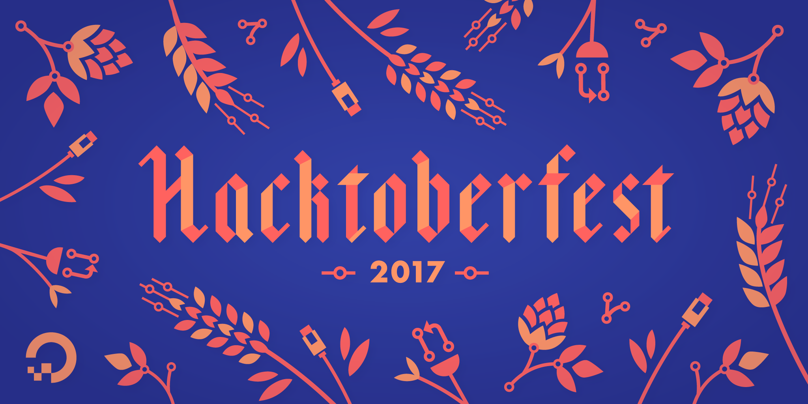

footer: Hacktoberfest Berlin | [@dkundel](https://twitter.com/dkundel) [@stefanjudis](https://twitter.com/stefanjudis) | #hacktoberfest
slidenumbers: false
build-lists: true
autoscale: true
code: Source Code Pro, auto

---

# Welcome!

---

# Who are we?

---

# Why are you here?

---

## Agenda

| | |
|---|---|
| 10:00 | Intro and Meet-and-greet ✅ |
| 10:15 | Optional workshop "Getting started with Open Source" 📝  |
| 10:15 | Start hacking and contributing 🙌 |
| 13:00 | Lunch time 🍽 |
| 17:00 | Show & Tell 🗣 |
| 18:00 | Bye 👋 |

---

# Thank you to our sponsors

---

## 💖 Code of Conduct 💖

## Be excellent to each other!

#### `bit.ly/hacktoberfest-coc`

#### `	+49 211 95986625` | `dkundel@twilio.com` | `@dkundel`

---

# Let's get hacking!

---

### _Getting started with_
# Open Source
### Intro to Git & GitHub

---

# What is

---

## Git is a version control system

- Keeps track of file changes (history)
- Work offline
- Work safely
- Files + history = repository

---

# What is GitHub?

---

# What is GitHub?

- Online host of git repositories
- Allows collaboration
- Used by most open source projects

---

# Git Jargon

---

### Git Jargon
# Repository

---

### Git Jargon
# Commits

---

### Git Jargon
# History / Logs

---

### Git Jargon
# Remotes

---

### Git Jargon
# Cloning

---

### Git Jargon
# Pushing / Pulling

---

### Git Jargon
# Branches

---

---

# GitHub Jargon

---

### GitHub Jargon
# Issues

---

### GitHub Jargon
# Pull Requests

---

### GitHub Jargon
# Forking

---

# ✨ Demo ✨

---

# Thank You!