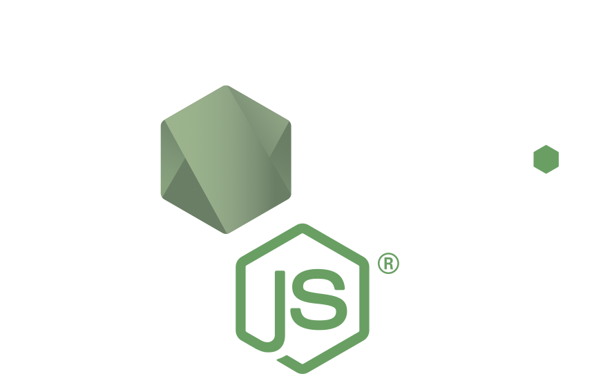

footer: Dominik Kundel ([@dkundel](https://twitter.com/dkundel))
slidenumbers: true
build-lists: true

#[fit] Intro to Node Development

---

# [fit] HI!
# I'm Dominik!

---

## About me

I'm a Developer Evangelist for Twilio, JavaScript developer and co-founder of jacobsHack!

### Get in touch with me!

[@dkundel](https://twitter.com/dkundel)
[dkundel@twilio.com](mailto:dkundel@twilio.com)
[github/dkundel](https://github.com/dkundel)

---

## What is Node?

^ In a nutshell Node allows you to execute JavaScript without a browser.
This gives you the chance to do many cool things

---

## [fit] The Race of JavaScript Engines

---

## [fit] Joyent presents Node.JS & NPM

---

## [fit] Mad Command-line Tools

---

## [fit] Build A Web Server

---

## [fit] Cross-platform Desktop Apps

---

## [fit] Let's Get Started!

---

## [fit] Install Node.JS and NPM
## https://nodejs.org

---

## [fit] `package.json`

---

# `$> npm help npm`

---

# `$> node --help`

---

# [fit] Coding Time!

---